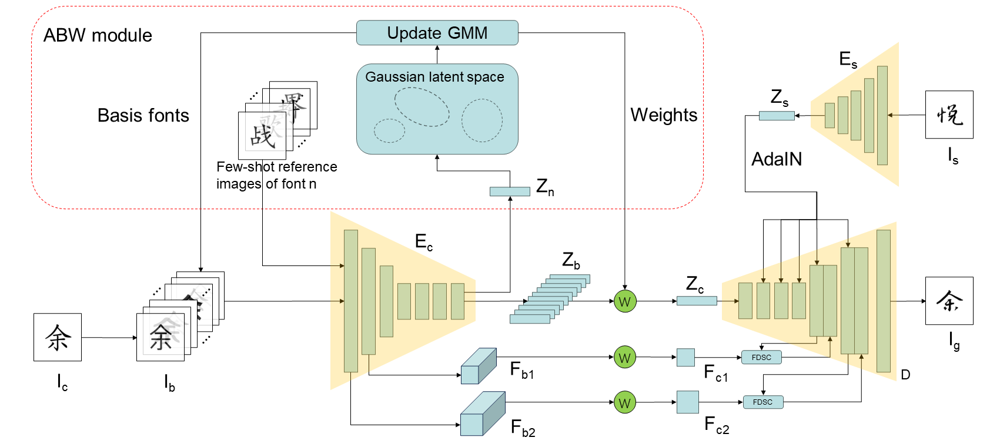

# ABW-Font: Learning Adaptive Basis Fonts to Fuse Content Features for Few-shot Font Generation
 
 
 
 This is the official release code for [Learning Adaptive Basis Fonts to Fuse Content Features for Few-shot Font Generation](http://iccvm.org/2025/papers/lncs/200.pdf). 
 
 Few-shot font generation aims to generate all characters of a certain font by using its very few seen characters as references. Recent studies \(such as [CF-Font](https://github.com/wangchi95/CF-Font)\) assumed that a target font can be regarded as a mixture of several source fonts, namely basis fonts, and the style of the target font can be generated by combining several latent representations respectively captured from a group of other fonts with given weights. However, these basis fonts along with their corresponding mixing weights are unlearnable.
 We propose adaptive basis fonts and weights learning Font (ABW-Font). Our ABW-Font can learn more appropriate basis fonts and content fusion weights.
 
 
 
 We project the reference characters into a Gaussian Mixture Model (GMM) distributed latent space, where each latent Gaussian collects latent representations of fonts with similar styles. An Rival Penalized Competitive Learning (RPCL) enhanced Expectation Maximization (EM) like learning algorithm is introduced to learn the GMM-structured latent space, jointly with the training of the network. The ABW module is also able to automatically determine an appropriate number of Gaussians in GMM, i.e., the number of basis fonts, making font mixing more flexible.
 # Trainning an ABW-Font
 ## Requirements
 ### Libarary
 pytorch (>=1.0)  
 tqdm  
 numpy  
 opencv-python  
 scipy  
 sklearn  
 matplotlib    
 pillow   
 tensorboardX  
 scikit-image  
 scikit-learn  
 pytorch-fid  
 lpips  
 pandas  
 kornia
 ### Deformable Convolutional Networks (DCN)
 Please refer to [https://github.com/chengdazhi/Deformable-Convolution-V2-PyTorch/tree/pytorch_1.0.0](https://github.com/chengdazhi/Deformable-Convolution-V2-PyTorch/tree/pytorch_1.0.0) to install the dependencies of deformable convolution.
 ## Dataset
 Putting your font files to the folder `data/fonts/Seen_fonts` and `data/fonts/Unseen_fonts`.
 Then running the following scripts to build dataset.
 ```sh
 sh scripts/01a_gen_date.sh
 sh scripts/01b_copy_subset.sh
 ```
 ## Training
 First, training a base network without ABW module.
 ```sh
 sh scripts/02a_run_ddp.sh
 ```
 Calculating basis fonts and weights on seen fonts at the begining of training.
 ```sh
 #content embeddings collection
 sh scripts/03a_get_content_embeddings.sh
 #getting the basis fonts and weights at the beginning of training
 sh scripts/sh scripts/03b_cluster_get_ABW_basis.sh
 ```
 Running the following scripts in sequence to train an ABW-Font.
 ```sh
 #preparing for ABW-Font training
 sh scripts/03c_copy_basis_subset.sh
 sh scripts/03e_init_ABW_env.sh
 #training ABW-Font
 sh scripts/03f_run_ddp_ABW.sh
 ```
 The final basis fonts and weights on seen fonts are already calculated during training, you can find them in `/basis`. Then calculating weights on unseen fonts by running:  
 ```sh
 sh scripts/03f_cal_ABW_weights.sh
 ```
 We also provide an pre-trained ABW-Font model, and you can get them from link.
 ## Generating and calculating metrics
 Run the following scripts in sequence:
 ```sh
 #generating images
 sh scripts/04a_run_inf_ABW.sh
 #calculating metrics
 sh scripts/04b_get_scores.sh
 sh scripts/04c_cal_mean_scores.sh
 ```
 # Acknowledgements
 We would like to thank [方正字库](https://www.foundertype.com/), which provides free font download for non-commercial users. We would like to thank CF-Font, and our code is based on [CF-Font](https://github.com/wangchi95/CF-Font).
 
 # Citation
 If you find this project useful for academic purposes, please cite it as:
 ```
 @InProceedings{ABW_Font,
   Title                    = {Learning Adaptive Basis Fonts to Fuse Content Features for Few-shot Font Generation},
   Author                   = {Keyang Lin, Zhijun Fang, Sicong Zang, Hang Wu},
   Booktitle                = {Computational Visual Media Conference},
   Year                     = {2025},
 }
 ```
